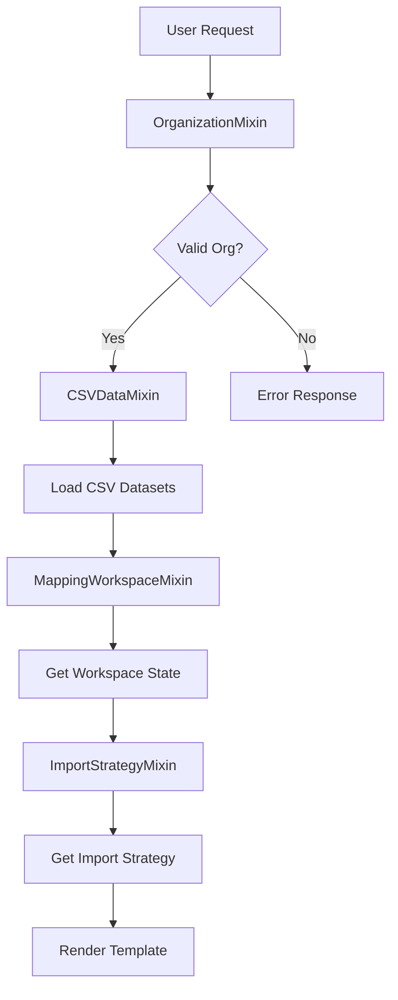

# CSV Mapping Editor - Mixin Architecture Overview

## 🏗️ Architecture Summary

We have successfully created a **mixin-based architecture** for the CSV Mapping Editor that provides clean separation of concerns and maximum reusability.

## 📁 Project Structure

```
arkumu/metadata/views/csv_mapping/
├── __init__.py                      # Package init
├── README.md                        # Implementation progress
├── ARCHITECTURE.md                  # This file - architecture overview
├── csv_mapping_views.py            # Main views using mixins
└── mixins/                          # Mixin package
    ├── __init__.py                  # Mixins package exports
    ├── base.py                      # OrganizationMixin
    ├── csv_data.py                  # CSVDataMixin
    ├── workspace.py                 # MappingWorkspaceMixin
    └── import_strategy.py           # ImportStrategyMixin
```

## 🧩 Mixin Architecture

### Core Design Principles
- **Single Responsibility**: Each mixin handles one specific domain
- **Composition over Inheritance**: Views mix and match functionality as needed  
- **Reusability**: Mixins can be used across different views
- **Testability**: Each mixin can be tested independently

### Mixin Breakdown

```python
# Organization Management
class OrganizationMixin:
    """Handles S3 organization discovery and validation"""
    - get_organization_id_from_request()
    - get_available_organizations()
    - validate_organization_exists()
    - get_organization_context()

# CSV Dataset Operations  
class CSVDataMixin:
    """Handles CSV dataset discovery, loading, and selection"""
    - get_csv_datasets_for_organization()
    - get_dataset_preview()
    - toggle_dataset_selection()
    - get_selected_datasets_with_details()

# Column Workspace Management
class MappingWorkspaceMixin:
    """Handles column selection, configuration, and workspace state"""
    - get_workspace_columns()
    - add_column_to_workspace()
    - update_column_configuration()
    - set_anchor_column()
    - get_workspace_statistics()

# Import Strategy Configuration
class ImportStrategyMixin:
    """Handles SmartBulkUpdaterPolars configuration and strategy"""
    - get_import_strategy()
    - update_import_strategy()
    - validate_import_strategy()
    - generate_smartbulkupdater_config()
```

## 🎯 View Composition

### Main Editor View
```python
class CSVMappingEditorView(
    OrganizationMixin,           # Organization discovery
    CSVDataMixin,                # CSV dataset loading
    MappingWorkspaceMixin,       # Column workspace
    ImportStrategyMixin,         # Import strategy
    View
):
    """Complete CSV mapping editor functionality"""
```

### Dataset Management Views
```python
class CSVDatasetCardView(
    OrganizationMixin,           # Organization context
    CSVDataMixin,                # Dataset preview
    MappingWorkspaceMixin,       # Selected columns
    View
):
    """Dataset preview and selection"""

class ToggleDatasetSelectionView(
    OrganizationMixin,           # Organization context
    CSVDataMixin,                # Dataset selection
    View
):
    """Dataset toggle functionality"""
```

### Column Management Views
```python
class AddColumnToWorkspaceView(
    OrganizationMixin,           # Organization context
    MappingWorkspaceMixin,       # Column management
    View
):
    """Add columns to workspace"""
```

## 🔄 Data Flow



## 🎮 Session Management

All mixins use **session-based state management** with consistent key patterns:

```python
# Session Keys Pattern
workspace_columns_{organization_id}     # MappingWorkspaceMixin
selected_datasets_{organization_id}     # CSVDataMixin
import_strategy_{organization_id}       # ImportStrategyMixin

# Cache Keys Pattern
available_organizations_s3              # OrganizationMixin (cached)
```

## 🚀 Benefits Achieved

### 1. **Maintainability**
- Changes to organization logic → Only edit `OrganizationMixin`
- Changes to CSV handling → Only edit `CSVDataMixin`
- Changes to workspace → Only edit `MappingWorkspaceMixin`
- Changes to import strategy → Only edit `ImportStrategyMixin`

### 2. **Reusability**
- Need just organization validation? → Use `OrganizationMixin`
- Need CSV + workspace? → Use `CSVDataMixin + MappingWorkspaceMixin`
- Need complete functionality? → Use all 4 mixins

### 3. **Testability**
```python
# Test each mixin independently
class TestOrganizationMixin(unittest.TestCase):
    def test_get_organization_context(self):
        # Test organization logic in isolation

class TestCSVDataMixin(unittest.TestCase):
    def test_csv_dataset_discovery(self):
        # Test CSV logic in isolation
```

### 4. **Extensibility**
- New functionality? → Create new mixin
- Need file uploads? → Add `FileUploadMixin`
- Need validation? → Add `ValidationMixin`
- Views compose exactly what they need

## 🏁 Current Status

**✅ COMPLETED:**
- Mixin architecture fully implemented
- Main editor view using all mixins
- Import strategy management ready
- Session management standardized
- Error handling with proper organization validation

**⏳ NEXT STEPS:**
- Step 2: Implement dataset card views using existing mixins
- Step 3: Implement column workspace views using existing mixins  
- Step 4: Implement FK configuration views using existing mixins

## 🔧 Integration Points

### SmartBulkUpdaterPolars Integration
```python
# Generate config for SmartBulkUpdater
config = import_strategy_mixin.generate_smartbulkupdater_config(
    request, organization_id, selected_columns
)

# Config includes:
# - update_strategy, link_topology, bulk_size
# - column_mappings with FK relationships
# - anchor_column configuration
# - multi_value_threshold settings
```

### Template Integration
```python
# Templates receive rich context from all mixins:
context = {
    **org_context,                    # OrganizationMixin
    'csv_datasets': csv_datasets,     # CSVDataMixin
    'selected_columns': columns,      # MappingWorkspaceMixin
    'import_strategy': strategy,      # ImportStrategyMixin
    'workspace_stats': stats,         # MappingWorkspaceMixin
}
```

This architecture provides a solid foundation for implementing the remaining Steps 2-4 with maximum efficiency and minimal code duplication! 