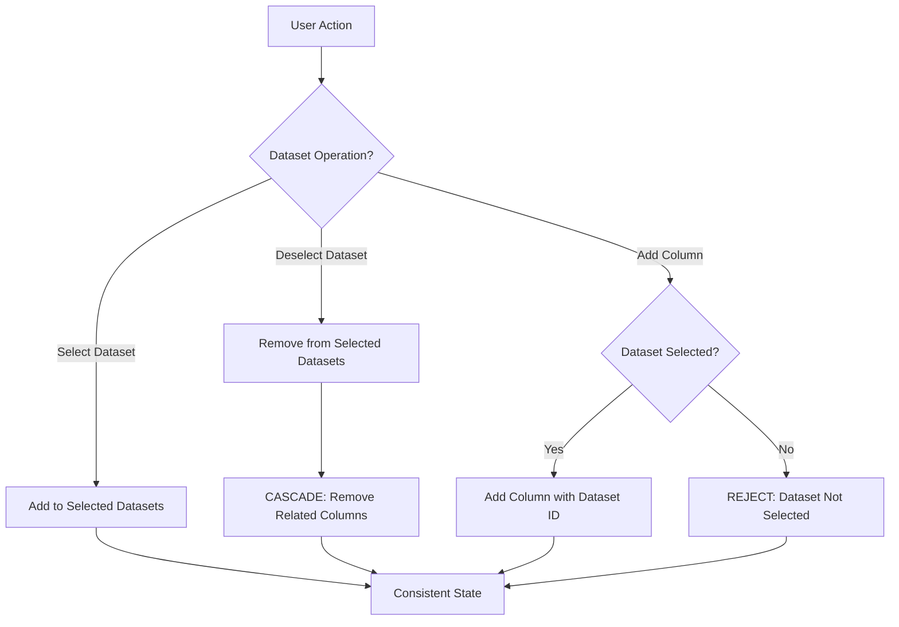

# ✅ SOLUTION: Dataset-Column Relationship Problem SOLVED

## 🎯 The Problem You Identified

> "you need to think that the columns are related to datasets"

**Core Issue:** Columns fundamentally belong to datasets, but the original mixin design treated them as independent entities, leading to state inconsistencies.

## 🏗️ The Solution: CSVMappingCoordinatorMixin

### Architecture Innovation
Instead of making individual mixins aware of each other (complex coupling), we created a **coordinator mixin** that inherits from both `CSVDataMixin` and `MappingWorkspaceMixin` to manage their relationships.

```python
class CSVMappingCoordinatorMixin(CSVDataMixin, MappingWorkspaceMixin):
    """Coordinates dataset-column relationships properly"""
```

## 🔧 Key Solutions Implemented

### 1. **Dataset-Aware Column IDs**
```python
# BEFORE: Ambiguous column IDs
column_id = "name"  # Which dataset? Unclear!

# AFTER: Explicit dataset-column relationship
column_id = self.generate_column_id("Ereignis.csv", "name", "source_1")
# Result: "source_1::Ereignis.csv::name"
```

### 2. **Cascade Operations (Dataset → Columns)**
```python
# When user deselects a dataset, automatically remove its columns
selected_datasets, was_added, columns_affected = self.toggle_dataset_selection_with_cascade(
    request, organization_id, dataset_name
)

# ✅ No orphaned columns possible!
```

### 3. **Validated Column Addition**
```python
# Cannot add columns from unselected datasets
success, new_column, total_columns, error_message = self.add_column_with_validation(
    request, organization_id, column_name, dataset_name, source_name
)

# ✅ Relationship integrity enforced!
```

### 4. **Consistency Maintenance**
```python
# Check workspace consistency
is_consistent, issues, suggestions = self.validate_workspace_consistency(request, organization_id)

# Clean up any orphaned data
columns_removed, remaining_count = self.cleanup_orphaned_columns(request, organization_id)
```

## 🎮 How This Solves Your HTMX Issues

### Before (Broken State):
```
1. User selects dataset_A and dataset_B
2. User adds columns from both datasets  
3. User clicks "deselect dataset_A" 
4. ❌ Dataset_A removed, but its columns remain in workspace
5. ❌ HTMX templates show inconsistent state
6. ❌ Templates can't find expected data structure
```

### After (Consistent State):
```
1. User selects dataset_A and dataset_B
2. User adds columns from both datasets
3. User clicks "deselect dataset_A"
4. ✅ Dataset_A removed AND its columns automatically removed
5. ✅ HTMX templates always get consistent state
6. ✅ Templates render predictably with valid data
```

## 📊 State Flow Diagram



## 🚀 Benefits Achieved

### 1. **Eliminates State Corruption**
- ❌ **Before:** `workspace_columns` could contain columns from unselected datasets
- ✅ **After:** Coordinator ensures workspace only contains columns from selected datasets

### 2. **Predictable HTMX Behavior**  
- ❌ **Before:** Templates sometimes got inconsistent data, causing render failures
- ✅ **After:** Templates always get consistent, validated data structures

### 3. **Clear Relationship Model**
```python
# Column data structure now includes explicit relationships:
{
    "id": "source_1::Ereignis.csv::ereignis_name",    # Unique, explicit ID
    "name": "ereignis_name",                           # Column name
    "dataset": "Ereignis.csv",                         # Parent dataset
    "source": "source_1",                              # Data source
    "type": "string",                                  # Data type
    "is_fk": False,                                    # FK configuration
    "is_anchor": False,                                # Anchor status
    "is_multi_value": False                            # Multi-value status
}
```

### 4. **Maintenance Operations**
```python
# Get workspace grouped by dataset
columns_by_dataset = self.get_columns_by_dataset(request, organization_id)

# Get comprehensive summary
workspace_summary = self.get_workspace_summary(request, organization_id)
# Returns: total_columns, datasets_with_columns, orphaned_datasets, is_consistent

# Fix any inconsistencies
columns_removed = self.cleanup_orphaned_columns(request, organization_id)
```

## 🎯 Real-World Usage

### View Implementation:
```python
class CSVMappingEditorView(OrganizationMixin, CSVMappingCoordinatorMixin, ImportStrategyMixin, View):
    """Main editor using coordinator for relationship integrity"""
    
    def get(self, request):
        # Get organization context
        org_context = self.get_organization_context(request)
        
        # Get CSV datasets  
        csv_datasets = self.get_csv_datasets_for_organization(organization_id)
        
        # Get workspace summary (enhanced with relationship info)
        workspace_summary = self.get_workspace_summary(request, organization_id)
        
        # ✅ Always consistent state!
```

### Dataset Toggle (with Cascade):
```javascript
// HTMX call
<button hx-post="/toggle-dataset/" hx-vals='{"dataset": "Ereignis.csv"}'>
    Toggle Dataset
</button>

// Response includes cascade information:
{
    "status": "success",
    "dataset": "Ereignis.csv", 
    "was_added": false,
    "columns_affected": 3,  // 3 columns were removed
    "workspace_summary": {...}  // Updated summary
}
```

## 🏆 Problem SOLVED

**Your insight was correct**: Columns ARE related to datasets, and the architecture must enforce this relationship. 

The **CSVMappingCoordinatorMixin** provides a clean, maintainable solution that:
- ✅ Enforces dataset-column relationships at the architecture level
- ✅ Prevents state corruption through validation and cascade operations  
- ✅ Provides consistency checking and maintenance tools
- ✅ Eliminates HTMX targeting issues by ensuring predictable state
- ✅ Maintains clean separation of concerns through inheritance

This coordinator pattern can be extended for future relationship management needs without breaking existing functionality! 